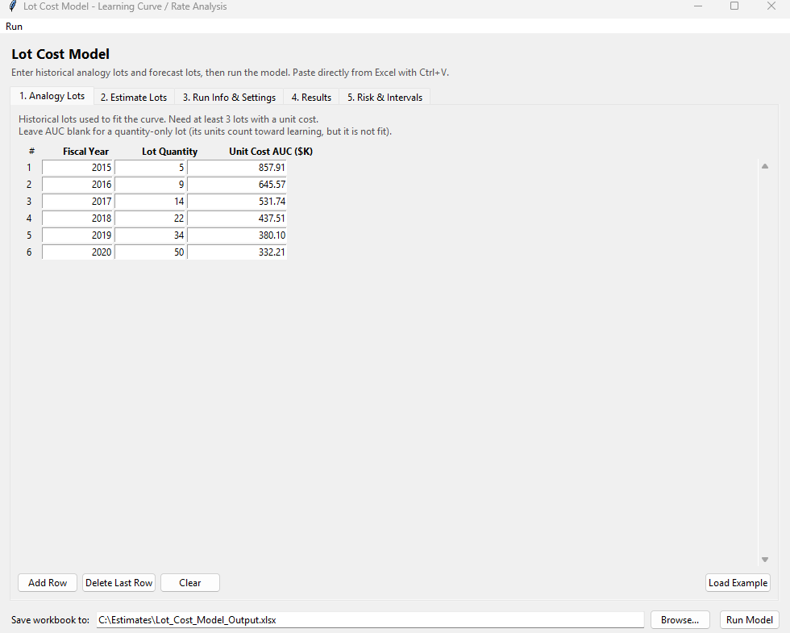
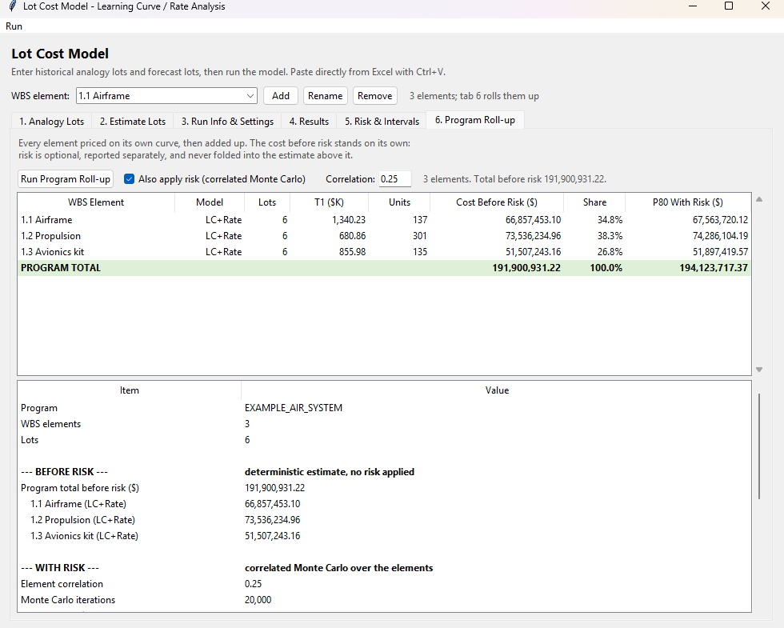
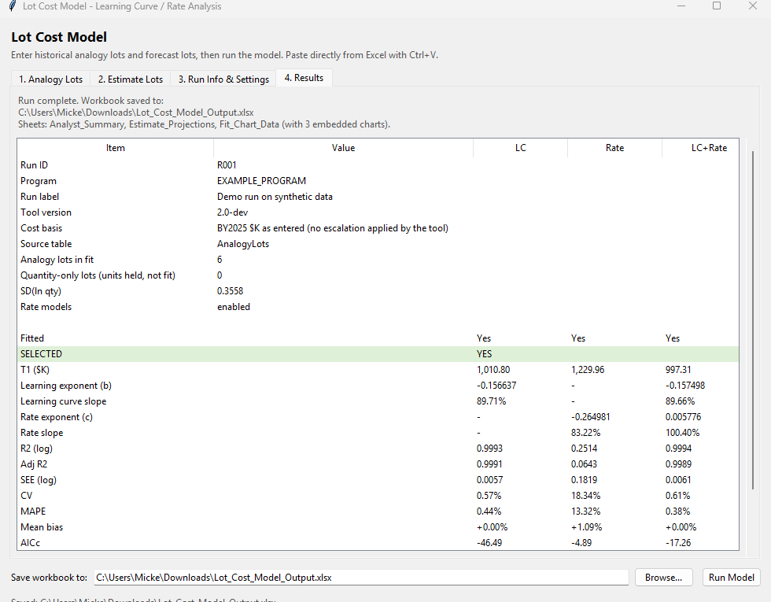
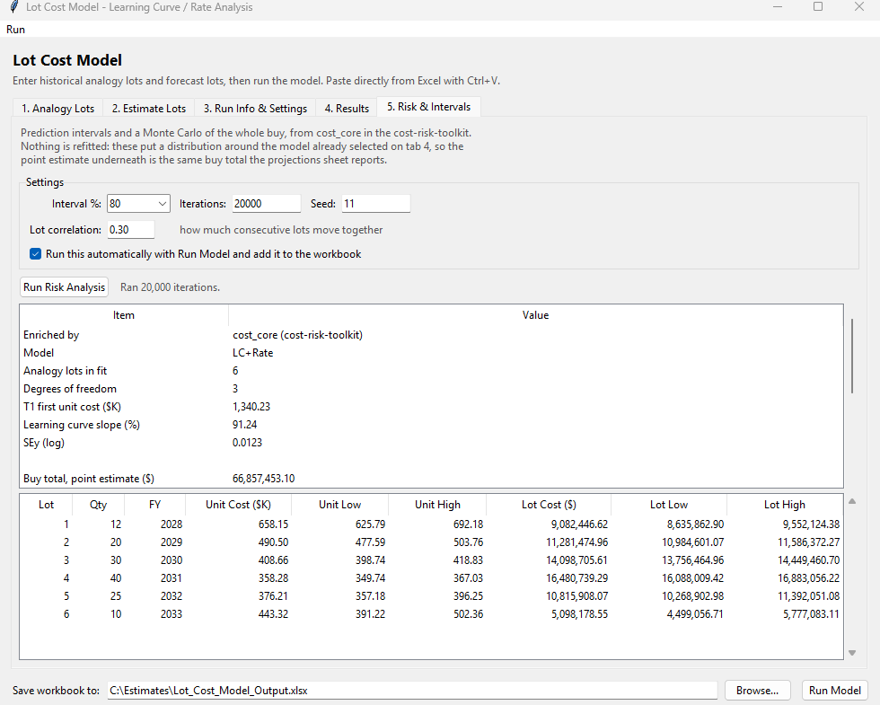
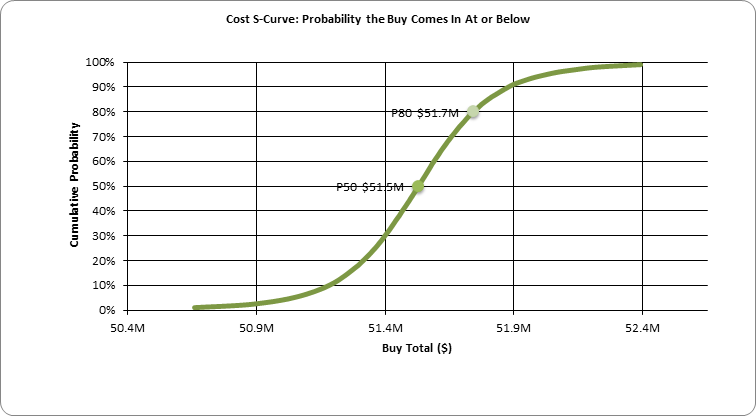

# Lot Cost Model

[](https://github.com/MichaelFowler1/lot-cost-model/actions/workflows/tests.yml)

A desktop tool for fitting learning curves to historical production lots and
projecting unit costs for future buys. You type your lots into a window, click
Run, and get an Excel workbook back with the fit statistics, the lot-by-lot
projections, and three charts.

It fits three competing models, tells you which one it picked and why, and can
put a prediction interval and a Monte Carlo around the answer.



## Correction: rate projections were overstated

**If you produced an estimate with this tool and the Rate or LC+Rate model was
selected, that estimate is too high and should be re-run.** LC selections are
unaffected, because LC has no rate term to drop.

The tool fitted `cost = T1 * midpoint^b * qty^c` and then projected without the
`qty^c` factor, so the printed lot costs did not satisfy the printed equation.
Dropping that term evaluates the fit at a lot quantity of one unit while
keeping the real lot's learning position, which is not a production rate anyone
chose to hold it at. The rate exponent is negative and lot quantities are
greater than one, so the error only ever ran upward. The Rate model had the
same problem from the other direction: it regresses on lot quantity but was
projected on the lot midpoint.

How far off depends on the rate exponent and the lot sizes. On the fixture in
`tests/test_equation_conformance.py`, which back-casts six lots whose real
total is known, LC+Rate came out **36% high**, and the P80 it fed into the risk
tab was overstated by about as much.

The setting that controlled this, `ToolMatchProjection`, is now
`LegacyRateOmission` and defaults to `False`. The old behaviour is still
reachable for reconciling against a workbook produced earlier, but you have to
ask for it by name. Passing the old key raises rather than being ignored, since
a caller who wanted legacy behaviour and silently got the corrected numbers
would be worse off than one who gets an error.

The tests that would have caught this now exist. They retype each fitted
equation, evaluate it for every projected lot, and compare to the cent the
column is rounded to. The previous suite passed with the defect present *and*
absent, which is exactly why it survived: shape tests ("unit cost falls across
the buy") stay true when every number is scaled, and consistency tests ("the
risk total matches the projections sheet") only confirm that two numbers
derived from the same wrong projection agree with each other.

## What it does

Give it a set of historical lots (fiscal year, quantity, average unit cost) and
a buy profile you want costed (fiscal year, quantity, complexity factor). It
then fits:

- **LC**, a plain learning curve on the lot midpoint
- **Rate**, cost against lot quantity only
- **LC+Rate**, both terms together

The learning curve fit isn't a simple regression. Lot midpoint depends on the
learning slope, and the slope depends on the midpoint, so the solver iterates
until the exponent stops moving. That's the same goal-seek loop you'd set up by
hand in Excel, just automated.

Model selection runs on the t-statistic of the rate coefficient with AICc as a
tiebreaker. If the rate term isn't significant, you get the plain learning
curve. If your lot quantities are too uniform to say anything about rate, the
rate models get gated off entirely and the summary tells you so instead of
quietly handing you a garbage coefficient.

## Requirements

Python 3.9 or newer, plus:

```
pip install numpy pandas openpyxl
```

The interface uses tkinter, which already ships with Python, so there's nothing
else to install. CI runs the suite on 3.9 and 3.10 as well as 3.11 to 3.14, so
both the floor and the ceiling are checked rather than assumed.

### Optional: risk analysis

Tab 5 adds prediction intervals and a Monte Carlo of the whole buy, and tab 6
adds the correlated program roll-up. Those lean on `cost_core` from the
[cost-risk-toolkit](https://github.com/MichaelFowler1/cost-risk-toolkit),
which needs Python 3.11 or newer:

```
pip install git+https://github.com/MichaelFowler1/cost-risk-toolkit.git
```

Skip it and everything else still works: the three model fits, model
selection, the projections, the WBS roll-up and every cost-before-risk total.
Only the risk halves of tabs 5 and 6 go dark, and they tell you how to install
it. That is the whole difference between running on 3.9 and running on 3.11.

## Running it

```
python lot_cost_model.py
```

Fill in tabs 1 and 2, set your run info on tab 3, then click Run Model. Results
land on tab 4 and the workbook saves wherever the path box points.

Both grids take a paste straight from Excel. Copy your columns, click the first
cell, press Ctrl+V, and it fills the rows and adds more as needed. Tabs, commas,
and plain spaces all work as separators.

Each grid also has a Load Example button if you just want to see it run.

## Rolling up a WBS

One element is a study. A cost estimate is usually several, so tab 6 adds them
up.

Each element carries its own analogy history and gets its own curve: the
airframe learns at one rate, the engines at another, and neither is told about
the other. What they share is the buy schedule. Fiscal years belong to the
program, while the quantity per lot belongs to the element, which is what lets
a kit buy or a spares provision change the count without changing when it is
bought. An element that sits out a lot has a quantity of zero there rather than
a missing row.



Use the **WBS element** bar above the tabs to add, rename and switch between
elements. Tabs 1 to 5 always show the element you have selected; tab 6 is the
whole program. A new element inherits the fiscal years already entered, with
the quantities left blank for you to fill in.

There is no coded limit on how many elements you can add. Forty roll up in
about three seconds including the risk simulation, and each one needs at least
three analogy lots with a cost, same as a single-element run.

### Cost before risk, on its own

Risk is optional here and is never folded into the estimate above it. The
roll-up reports the deterministic total first, broken out by element, and the
risk block sits underneath as a separate section. Untick **Also apply risk**
and you get the point estimate alone, with the workbook and the on-screen table
showing exactly the same numbers.

The element table keeps them in separate columns, `Cost Before Risk ($)` and
`P80 With Risk ($)`, so there is no way to read one for the other.

### Funding by fiscal year

`by_lot` is the estimating view: one row per lot with a year beside it. The
**Funding by FY** tab and the `Program_By_FY` sheet are the budget view, one row
per year whatever the lot structure, with each element as a column plus a
running cumulative and each year's share of the program.

The two differ whenever two lots fall in the same year. There the lot table
shows two rows and the funding line shows one, which is what a budget exhibit
wants. Years run consecutively, so a year with no buy in it shows as a zero
rather than going missing: a funding profile with a hole in it should show the
hole.

Every lot's cost sits in the year it is awarded. Spreading a lot across the
years it is actually spent over, an outlay or expenditure profile, is a
separate thing this does not do.

### Why the risk roll-up is not a column of SUMs

Elements on one program share a workforce, a supply base and a schedule, so
their overruns arrive together. Adding independent distributions understates
the variance of the total by `1 + rho(k-1)`, and the error lands on the upper
tail where the P80 lives. The roll-up correlates the elements at a single
default of 0.25 and reports what independence would have cost: on the bundled
three-element demo, 1.21x on the standard deviation and about 16% of the P80
reserve.

One approximation is disclosed rather than buried. `cost_core`'s WBS model
takes distributions, not raw draws, so each element's simulated total is
summarised as a lognormal before being correlated with the others. An element
total is a sum of correlated lognormal lot costs and is not itself lognormal,
so no two-parameter fit reproduces it exactly. Log-space matching was picked by
measuring three candidates against the empirical percentiles: it tracks to
about half a percent at P80 and beat both arithmetic moment-matching and a
normal. A test bounds it, and every run says to read the program percentiles at
that resolution.

### Three more views on tab 6

**Tornado** ranks elements by share of program variance, using the covariance
decomposition `Cov(X_i, T)/Var(T)`, so the contributions add to exactly one and
attribute correctly under correlation. This is not the same ranking as size: an
element that is only moderately variable but moves with everything else
contributes more than its cost share suggests. On the demo, propulsion carries
41.8% of the variance against 37.3% of the cost.

**Influence** shows leverage, Cook's distance and DFFITS for every analogy lot,
from `cost_core`. At six lots one lot can set the slope while every summary
statistic still looks healthy, and on the bundled data the smallest lot is
flagged as influential in all three elements. These are flags, not verdicts:
the largest or smallest lot in a sample has high leverage by construction, and
dropping it for that reason alone would be indefensible.

**Buy sensitivity** reprices the whole program at other buy sizes. Every
element's quantities scale together, so two engines per aircraft and a spares
provision keep their proportion rather than drifting, and quantities stay whole
units. Buying 40% fewer raises unit cost by about 16% on the demo, which is the
learning and the rate term working together and the question estimators are
asked most often.

### Three kinds of element

A WBS is not all hardware, and forcing a learning curve onto something that
does not learn is fitting a shape the work does not have. So an element is one
of three things, chosen when you add it:

**Priced from its own lots.** Hardware with an analogy history. Gets its own
curve, its own model selection, its own quantity per lot.

**A percentage of other elements.** Systems engineering and program management
are the usual cases: they scale with the hardware they support. The factor is
applied lot by lot rather than to the total, so engineering inherits the
phasing of the hardware rather than being spread flat. Factors can sit on other
factors, which is how PM on hardware-plus-SE actually works, so elements are
priced in dependency order. A basis naming something that does not exist, an
element used as its own basis, and a circle between factors are each refused by
name before anything is priced.

**A cost entered lot by lot.** Non-recurring engineering, tooling,
qualification, anything that happens once. No curve, no quantity, just the
money in the lots it falls in.

Non-recurring work is normally quoted as one total and then phased, so
**Phase a total** does that for you: give it the total and say whether it falls
evenly, all in one lot, or by a percentage per year, and it fills in the lot
amounts. Those amounts remain what actually gets costed, and any year stays
editable afterwards, so the profile is a way of filling them in rather than a
rule the estimate depends on. Percentages that do not come to 100 are refused
rather than scaled, because scaling them would change the total you asked for.

Two things follow from an amount being non-recurring. It does not scale in the
buy sensitivity, since buying forty percent fewer articles does not buy forty
percent less design work, which is what correctly makes a small buy worse per
unit. And it is not in a factor's default basis, so engineering percentages are
not silently loaded on top of it; tick it explicitly if you want that.

Under risk the derived kinds inherit uncertainty rather than inventing it. A
factor is computed as its exact share of the same correlated draws its basis
came from, so its correlation with that basis is 1 by construction, which is
both true and stronger than any correlation the model could be told to assume.
An amount is carried as entered and contributes no variance, because nobody
measured any; it is still in every percentile, it just does not move. The
tornado covers all three kinds and still sums to one, with amount elements
landing at exactly zero.

Inflation is assumed already applied to every element. Escalation and
per-element prior units remain deliberately absent.

## Giving it to someone else

Two audiences, and they need different things.

**Someone who only needs to read the estimate** needs the workbook, not the
tool. Every sheet, chart, fit statistic and assumption is in there, and it
opens anywhere Excel does.

**Someone who needs to run it** needs Python. Where compiled executables are
blocked, which is common, `python tools/build_pyz.py` bundles the three modules
into a single `lot-cost-model.pyz`, about 220KB. That is a plain zip archive
rather than a binary, and it runs with the Python already on the machine:

```
python lot-cost-model.pyz
```

Be clear about what that does and does not solve. It removes "clone a
repository and keep three files together"; it does not remove the
dependencies. Whoever runs it still needs numpy, pandas and openpyxl, and
cost_core as well for the risk half. If they have those, one file is the whole
tool.

## Saving a run

The Run menu saves everything the window holds to a small JSON file: both sets
of lots, the run info, every setting, and the risk options. Open it later and
you are back where you were.

That is worth more than the typing it saves. A saved run makes an estimate
reproducible, and the Monte Carlo seed goes in the file too, so reopening it
six months later gives the same P80 rather than a similar one. It is also what
makes the correction below actionable: re-running an old estimate against a
fixed build is a file-open rather than a retyping exercise.

Reloading a run that was saved with the legacy rate projection restores that
setting and says so, rather than quietly reproducing overstated costs.

## Knowing what produced a workbook

The Analyst_Summary sheet opens with the tool version, the git revision when
run from a checkout, a timestamp, and whether the rate projection was the
corrected one or the legacy one:

```
Tool version      2.1.0 (d71f8f9)
Run timestamp     2026-08-21 19:45:45 Eastern Daylight Time
Rate projection   corrected (projections satisfy the fitted equation)
```

Before 2.1.0 that row read `2.0-dev` on every build ever released, so a
workbook could not be dated from the inside. If you are holding one that does
not carry these rows, it predates the correction, and if Rate or LC+Rate was
the selected model then its costs are overstated.

## A few things worth knowing

Leave the unit cost blank on an analogy lot to make it quantity-only. Those
units still count toward cumulative production and push later lots further down
the curve, but the lot itself doesn't get fit. Handy when you know a buy
happened but the cost is no good.

Leave a complexity factor blank and it carries the previous lot's value
forward, so you only type it when it changes.

You need at least three analogy lots with both a quantity and a cost. Four
before the rate models will even be attempted.

## Output

| Sheet | What's on it |
|---|---|
| `Analyst_Summary` | Side by side comparison of all three models, with the selection called out |
| `Estimate_Projections` | Row per forecast lot: midpoint, unit cost, lot cost before and after complexity, plus every fit statistic |
| `Fit_Chart_Data` | How each model did against the historical lots, with residuals, and three scatter charts |
| `Risk_Summary` | Fitted parameters, the buy total with its interval, the simulated percentiles, and the assumptions behind them |
| `Risk_Intervals` | Row per forecast lot with low and high bounds, and a chart of the band |
| `Risk_SCurve` | The simulated buy total at every percentile, with the S-curve charted and P50 and P80 marked |

A WBS roll-up writes a second workbook alongside it, suffixed `_program`, with
`Program_Summary`, `Program_Elements`, `Program_By_Lot` (a stacked cost-by-year
chart), `Program_SCurve`, `Program_Tornado`, `Buy_Sensitivity`,
`Element_Influence`, and one sheet per element.

The last three appear only when `cost_core` is installed and the risk analysis
ran.



## Risk and prediction intervals

The deterministic tabs give you a point estimate. They say nothing about how
much confidence it deserves, which is the first thing anybody reviewing an
estimate asks. Tab 5 answers it.



Rather than write the statistics a second time, this hands the same lots to
`cost_core` and reports what comes back: a prediction interval on every
forecast lot, and a Monte Carlo of the total buy with P50, P80 and P90. The
simulation propagates two things, parameter uncertainty in the fitted slope and
T1, which dominates on a short series, and lot-to-lot scatter, which is what
makes the answer a prediction about a real lot rather than a statement about
where the line sits. Future lots are correlated at 0.30 by default because
consecutive lots share a workforce and a schedule, and pretending otherwise
lets the shocks cancel and understates the spread of the whole buy.

The handoff is deliberately thin. `cost_core` is not asked to fit anything of
its own: `projection_intervals` and `simulate_buy` take the very objects
`run_lot_cost_model` already returned, so the intervals and the distribution
describe **this tool's own selected model**, on its own lot positions, with the
complexity factors already applied.

That matters for a reason worth stating plainly. The number under the
distribution is the same number on the projections sheet, identical by
construction rather than by luck, so the P80 cannot quietly belong to a
slightly different estimate than the one being briefed. There is no separate
theory or fitting method to choose here, because there is no separate fit.

The cost is that you lose an independent second opinion. An earlier version did
refit through `cost_core` with a different estimator, which gave a genuine
cross-check but meant two point estimates that had to be reconciled. Agreement
by construction was the better trade.

### The S-curve

Five percentiles in a table is a thin way to show a distribution, so the whole
thing gets charted. Cost runs along the bottom and cumulative probability up
the side, which is the orientation you read a P80 off. P50 and P80 are marked
and labelled with their cost.



Read it as: pick a number on the bottom axis, and the curve tells you the
chance the buy comes in at or below it.

### What it does not cover

Schedule risk, requirement changes, and rate changes the history never saw.
It's production cost risk conditional on the program continuing as it has been,
which is a narrower claim than a full risk model.

The complexity factor scales the interval as a certain multiplier. Its own
uncertainty isn't modelled.

And if you're pricing from unit 1, you're using the curve as an analogy for a
different program. Whether the slope carries across is a judgement about
product, process, rate and contractor. Nothing in the data can confirm it, and
the extra error it introduces is in none of the intervals. The tab says so on
every run.

## Tests

```
pip install -r requirements-dev.txt
pytest
```

224 tests with `cost_core` installed, fewer without (the risk ones skip). CI
runs both, because "works when the optional dependency is missing" is a claim
worth checking rather than asserting.

The most important ones are in `test_equation_conformance.py`. They retype each
fitted equation, evaluate it for every projected lot, and assert it matches the
projected cost to the cent. Nothing there reads a projected number to decide
what the answer should be, which is what makes them able to catch a wrong
formula. There is also a back-cast that prices the analogy lots as the estimate
and recovers their known actual total.

A few of them exist for a specific reason. The most important assert that the
risk numbers describe the same thing the projections sheet does: the same
selected model, one interval row per forecast lot, and a simulated
distribution whose point estimate matches the sheet's buy total. If those ever
drift apart the tool would be showing a distribution around a number it is not
displaying, which is the failure worth catching early.

That check earned its place. An earlier bridge reached into a private
`cost_core` hook, and CI caught the toolkit removing it within minutes of the
first run.

Others read chart features back out of the workbook XML. openpyxl raises
nothing when you assign to an attribute a class does not have, so a chart can
come out perfectly valid with the data labels silently missing, which is
exactly what shipped for a while. Those assertions parse the XML rather than
matching strings, since openpyxl serialises differently depending on whether
lxml happens to be installed.

## About the example data

The numbers behind the Load Example buttons are made up. They come from an 88%
learning curve with a 93% rate slope on a $1,200K first unit, plus a little
scatter, so the tool has something realistic to chew on without shipping
anybody's real program data.

The lot sizes were chosen deliberately. Every analogy lot is a different size,
spanning 5 to 50 units, which gives an SD(ln qty) of 0.85 against a floor of
0.05. That matters more than it sounds: with repeated quantities there is
nothing for a rate term to regress against, the Rate chart collapses into a
couple of clusters, and the rate models get gated off or come out
insignificant. Here all three fit, the rate coefficient reaches t = -4.3, and
LC+Rate is selected on its merits rather than LC winning by default.

The forecast grows to 40 units and then tapers to 10, so the rate term does
something you can see: unit cost turns back up on that last small lot, which a
pure learning curve cannot do.

One honest caveat, visible in the example itself. The combined fit is
excellent, at an R² of 0.9993 and MAPE under 1%, but the individual exponents
come back at 91.2% learning and 87.1% rate against a truth of 88% and 93%.
Because lot size rises monotonically, cumulative units and lot size move
together, so the two exponents trade off against each other even when the
prediction is nearly perfect. That is a real property of this kind of fit, and
part of why the selection logic leans on the significance of the rate
coefficient rather than on R² alone.

## License

MIT. See [LICENSE](LICENSE).
